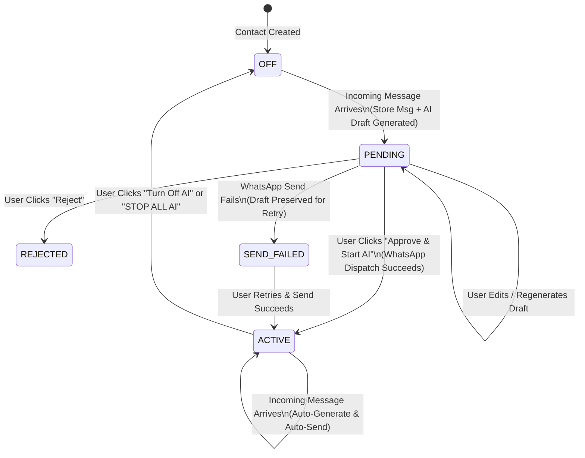

# AI-Powered WhatsApp Conversation Assistant (SUNFI AI)

> An AI-powered WhatsApp assistant that generates personalized replies in the user's personal communication style and enables human-approved conversation automation with per-contact control.

---

## 🌟 Product Identity & Key Concepts

**SUNFI AI** is **not** a basic autonomous chatbot. It is a personal AI communication assistant engineered around a strict human-in-the-loop control model:

> **AI NEVER OWNS THE CONVERSATION. THE USER OWNS THE STATE.**
>
> First Approval → AI Conversation becomes **ACTIVE** → AI automatically replies → User can turn it **OFF** at any time.

### Core Conversation States

| State | Visual Indicator | Description & Behavior |
|---|---|---|
| **OFF** | 🔴 `AI OFF` | AI is disabled. When a contact messages while `OFF`, the message is stored, an AI draft reply is generated, and the contact transitions to `PENDING` for human review. **No automatic WhatsApp messages are sent.** |
| **PENDING** | 🟡 `PENDING APPROVAL` | AI has generated a suggested draft reply for an incoming message. Surfaces in the dashboard awaiting explicit human action (**Approve & Start AI**, **Edit & Start AI**, **Reject**, or **Regenerate Tone**). |
| **ACTIVE** | 🟢 `AI ACTIVE` | The human user explicitly approved AI for this conversation. The AI automatically receives incoming messages, reads conversation context and long-term memory, generates natural replies, and sends them via WhatsApp. |

---

## 🛡️ Absolute Safety Hierarchy

```text
Global AI OFF
      ↓
No automatic AI message can ever be sent (Draft only or Store only)

Global AI ON + Contact OFF
      ↓
Incoming Message → Store msg → Generate draft → Transition to PENDING (Do NOT auto send)

Global AI ON + Contact PENDING
      ↓
Generate draft → Store in ai_replies → Wait for Human Approval

Global AI ON + Contact ACTIVE
      ↓
Generate reply → Auto send via Meta WhatsApp Cloud API
```

---

## 📐 System Architecture & State Machine

### Conversation State Machine



### Complete User & Webhook Pipeline

```text
Person sends WhatsApp message
        ↓
WhatsApp Cloud API
        ↓
Webhook / Sandbox Simulator Endpoint
        ↓
FastAPI Backend (Per-Contact Mutex Lock SELECT ... FOR UPDATE)
        ↓
Deduplication & Storage
        ↓
Check Global AI Status & Contact AI Status
        ↓
 ┌────────┼─────────┐
 ↓        ↓         ↓
OFF     PENDING    ACTIVE
 ↓        ↓         ↓
Generate Generate  Generate
draft    draft     reply
   \      /          ↓
  Dashboard      Send via WhatsApp API
      ↓              ↓
Human Approval   Save AI Message
      ↓
   ACTIVE
```

---

## 💻 Tech Stack

### Frontend
- **Framework**: Next.js 14+ (App Router)
- **Language**: TypeScript
- **Styling**: Tailwind CSS v4, Dark Mode
- **Icons**: Lucide Icons
- **HTTP Client**: Axios

### Backend
- **Framework**: Python 3.11+, FastAPI
- **Validation**: Pydantic v2 & Pydantic Settings
- **ORM & Database**: SQLAlchemy 2.0 (AsyncIO), SQLite (Local zero-config) / PostgreSQL (`asyncpg`)
- **Concurrency**: Per-Contact Mutex Locks (`asyncio.Lock` & SQL Row Locking)
- **AI Engine**: OpenAI API (`gpt-4o-mini`) with persona context builder & Banglish prompt engineering
- **WhatsApp Integration**: Meta WhatsApp Cloud API Client with configurable Graph API version (default `v22.0`) & Webhook Simulator Sandbox

---

## 📂 Monorepo Project Structure

```text
WhatsApp Intelligence/
├── frontend/                     # Next.js Dashboard UI
│   ├── app/
│   │   ├── layout.tsx            # Global layout with Navbar & Sidebar
│   │   ├── page.tsx              # Main Dashboard (Metrics, Approvals Grid, Active List, Sandbox Widget)
│   │   ├── inbox/page.tsx        # Conversation Inbox (Filter: All, Active, Pending, Off)
│   │   ├── conversations/[id]/page.tsx # WhatsApp-style Chat UI + Approval Banner & Manual Send
│   │   ├── contacts/page.tsx     # Contacts directory & preference settings
│   │   ├── settings/page.tsx     # AI Persona system prompt editor & Global AI Toggle
│   │   └── analytics/page.tsx    # Response metrics & Human-edit comparison logger
│   ├── components/
│   │   ├── Navbar.tsx
│   │   ├── Sidebar.tsx
│   │   ├── StatusBadge.tsx       # 🟢 ACTIVE, 🟡 PENDING, 🔴 OFF
│   │   ├── PendingApprovalCard.tsx # Approval action card
│   │   └── StopAllAiButton.tsx   # Emergency Stop All button
│   ├── lib/
│   │   ├── api.ts                # REST API client
│   │   └── types.ts              # TypeScript interfaces
│   └── package.json
│
├── backend/                      # FastAPI Python Backend
│   ├── app/
│   │   ├── main.py               # FastAPI app startup & table seeders
│   │   ├── core/
│   │   │   ├── config.py         # BaseSettings & Configurable WHATSAPP_API_VERSION
│   │   │   ├── database.py       # Async SQLAlchemy engine & mutex lock helpers
│   │   │   └── security.py       # JWT & password hashing
│   │   ├── models/               # SQLAlchemy Models (User, Contact, Message, AIReply, Memory, Setting)
│   │   ├── schemas/              # Pydantic Schemas
│   │   ├── services/
│   │   │   ├── state_machine.py  # Central state machine & execution pipeline
│   │   │   ├── memory_service.py # Summaries & history context
│   │   │   └── analytics_service.py # Metrics calculator
│   │   ├── ai/
│   │   │   ├── persona.py        # Default Sunfi Banglish/English persona
│   │   │   ├── prompt_builder.py # Context builder (Persona + Memory + Summary + History)
│   │   │   └── engine.py         # OpenAI SDK & fallback generator
│   │   ├── whatsapp/
│   │   │   ├── client.py         # Meta WhatsApp Cloud API Client (v22.0)
│   │   │   └── webhook_parser.py # Webhook payload parser & deduplication
│   │   └── api/
│   │       └── v1/               # REST API Endpoints (Auth, Contacts, Conversations, AI, Settings, Analytics, WhatsApp)
│   ├── tests/
│   │   ├── conftest.py           # In-memory async SQLite test fixture
│   │   └── test_state_machine.py # Pytest suite for all specification rules
│   └── requirements.txt
│
├── .env.example
└── README.md
```

---

## ⚡ Quickstart & Local Setup

### Prerequisites
- Node.js v18+ & npm
- Python 3.11+ (or `uv` python launcher)

### 1. Clone & Environment Setup
Copy `.env.example` to `.env`:
```bash
cp .env.example backend/.env
```

### 2. Backend Setup
```bash
cd backend
python -m venv venv
# On Windows PowerShell:
venv\Scripts\activate
pip install -r requirements.txt
```

Run pytest test suite:
```bash
venv\Scripts\python.exe -m pytest -v
```

Start FastAPI Backend server:
```bash
venv\Scripts\python.exe -m uvicorn app.main:app --reload --port 8000
```
- API Docs available at `http://localhost:8000/api/v1/docs`

### 3. Frontend Setup
```bash
cd frontend
npm install
npm run dev
```
- Next.js Dashboard available at `http://localhost:3000`

---

## 🧪 Automated Testing & Verification

The project includes an automated `pytest` test suite verifying all 8 specification requirements:

```bash
cd backend && venv\Scripts\python.exe -m pytest -v
```

### Verified Test Cases
1. `test_off_contact_receives_message_transitions_to_pending`: Verified OFF contact receives message -> message stored, AI draft generated, status transitions to `PENDING`, 0 WhatsApp messages sent.
2. `test_pending_contact_receives_another_message`: Verified draft is updated with full history, contact remains `PENDING`, 0 WhatsApp messages sent.
3. `test_user_approves_and_starts_ai_success`: Verified clicking **Approve & Start AI** transactionally sends WhatsApp message, sets status `ACTIVE`, marks reply `SENT`.
4. `test_active_contact_receives_message_auto_sends`: Verified ACTIVE contact automatically generates & sends replies without manual prompts.
5. `test_user_turns_off_ai`: Verified turning OFF AI immediately stops automatic sending.
6. `test_global_ai_off_prevents_auto_send`: Verified Global AI status `OFF` blocks all auto-sending across all contacts.
7. `test_message_deduplication`: Verified duplicate `whatsapp_message_id` webhooks are safely ignored.
8. `test_emergency_stop_all`: Verified **STOP ALL AI** disables AI across all active contacts.

---

## 🌐 WhatsApp Cloud API Integration & Webhook Simulator

### Live WhatsApp Webhook Verification
- **Verification URL**: `http://<your-domain>/api/v1/whatsapp/webhook`
- **Verify Token**: Configurable in `.env` (`WHATSAPP_VERIFY_TOKEN="sunfi_whatsapp_verify_token_2026"`)

### Built-in Sandbox Simulator
You can test the entire pipeline without live Meta WhatsApp credentials directly from the Next.js Dashboard using the **WhatsApp Webhook Simulator (Sandbox)** widget or API endpoint:
```bash
POST /api/v1/whatsapp/simulate-incoming
{
  "sender_phone": "8801700000001",
  "sender_name": "Rakib",
  "message_text": "bro ki obostha?"
}
```

---

## 🚀 Deployment Guide

### Frontend Deployment (Vercel)
1. Push `frontend` directory to GitHub repository.
2. Import project into Vercel.
3. Set environment variable: `NEXT_PUBLIC_API_URL=https://your-backend-api.onrender.com/api/v1`.

### Backend Deployment (Render / Railway)
1. Deploy `backend` directory to Render or Railway Web Service.
2. Build Command: `pip install -r requirements.txt`.
3. Start Command: `uvicorn app.main:app --host 0.0.0.0 --port 8080`.
4. Configure environment variables (`DATABASE_URL`, `OPENAI_API_KEY`, `WHATSAPP_ACCESS_TOKEN`, `WHATSAPP_PHONE_NUMBER_ID`, `WHATSAPP_VERIFY_TOKEN`, `WHATSAPP_API_VERSION="v22.0"`).

---

## 📜 License & Author

Developed by Antigravity AI Team for the personal AI WhatsApp Assistant specification.
